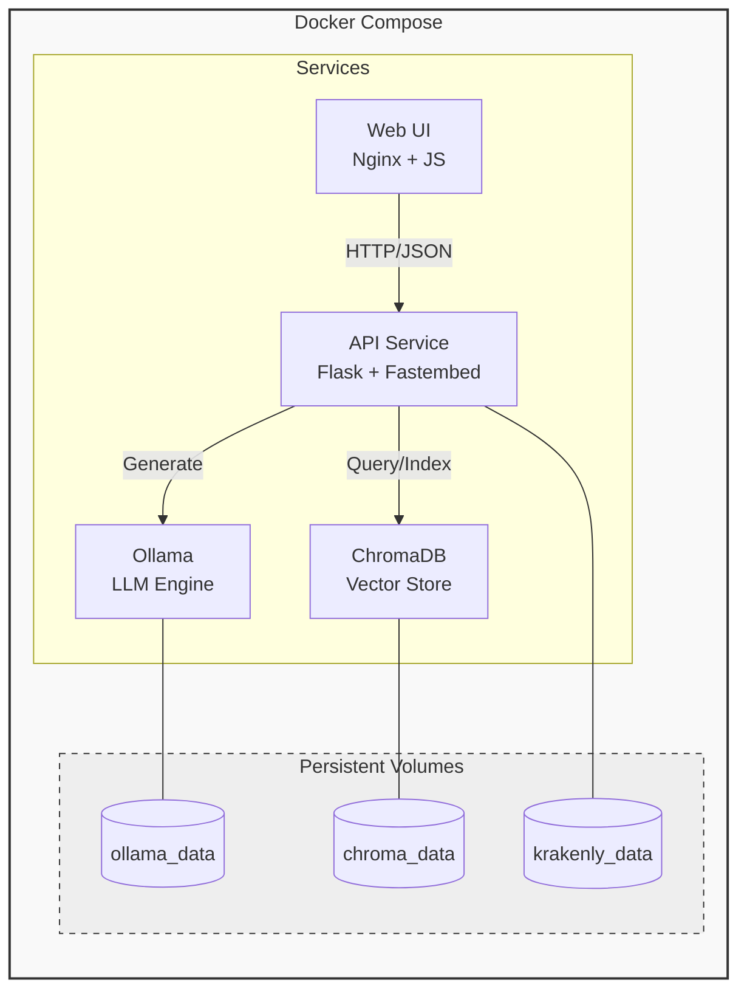

# 🐙 Krakenly

[](https://hub.docker.com/r/krakenly/krakenly)
[](https://github.com/krakenly/krakenly/pkgs/container/krakenly)
[](https://github.com/krakenly/krakenly/releases)

[](https://github.com/krakenly/krakenly/actions/workflows/ci.yml)
[](https://github.com/krakenly/krakenly/actions/workflows/integration-test.yml)

**Your data. Your AI. Your machine.**

A fully local, privacy-focused AI assistant that runs entirely on your machine using Docker. Perfect for personal home servers, NAS devices, or any always-on machine. Unlike cloud-based AI services, Krakenly keeps all your data private—nothing ever leaves your machine.

### Why run AI locally?

- 🔐 **Complete Privacy**: Your data never leaves your machine—no cloud uploads, no third-party access
- 💰 **Zero Ongoing Costs**: No API fees, no subscriptions, no usage limits—run it as much as you want
- 🎛️ **Full Control**: Choose your models, customize behavior, and own your entire AI stack

## Table of Contents

- [What is this?](#what-is-this)
- [Components](#components)
- [Features](#features)
- [Architecture](#architecture)
- [Quick Start](#quick-start)
- [Deployment Options](#deployment-options)
  - [Docker Compose](#docker-compose)
  - [Kubernetes](#kubernetes)
  - [Prerequisites](#prerequisites)
- [Usage](#usage)
- [Documentation](#documentation)
- [Common Commands](#common-commands)
- [Project Structure](#project-structure)
- [License](#license)

## What is this?

Krakenly is a **Retrieval-Augmented Generation (RAG)** system that lets you chat with your own data. Upload any text, markdown, or JSON files, and the AI will answer questions based specifically on your content rather than generic knowledge. Think of it as having a personal research assistant that has read and understood all your data.

### How it works

1. **Index your data** - Upload files through the web interface or API
2. **Ask questions** - The system searches your data for relevant context
3. **Get grounded answers** - The AI generates responses based on your data, citing sources

### Key difference from cloud-based AI

Cloud AI services answer from their training data. Krakenly answers from **your data**. If the information isn't in your indexed data, it will tell you rather than making something up. Plus, your data never leaves your machine.

## Components

This system uses **official images** for maximum reliability and minimal footprint:

- **Ollama**: Official `ollama/ollama` image for LLM inference (`qwen2.5:3b`)
- **ChromaDB**: Official `chromadb/chroma` image for vector storage
- **API Service**: Modular REST API with Fastembed embeddings (`bge-small-en-v1.5`)
- **Web Manager**: Browser-based UI for data management and AI chat

## Features

- 🔒 **100% Local**: All services run on your machine - no data leaves your system
- 🏠 **Home Server Ready**: Perfect for NAS, Raspberry Pi, or any always-on machine
- ⚡ **Optimized**: Official images, ONNX embeddings, efficient LLM inference
- 🤖 **Local LLM**: Uses Ollama with quantized models (`qwen2.5:3b` by default)
- 🔍 **Semantic Search**: Find relevant data using vector similarity
- 📚 **RAG Support**: Context-aware AI responses using your indexed data
- 🧠 **Smart Preprocessing**: Enhanced data chunking with entity extraction, relationships, and Q&A formatting
- 🌐 **Web Interface**: Browser-based UI for file uploads, search, and AI chat
- 🐳 **Docker Compose**: Simplified local deployment with pre-built images
- ☸️ **Kubernetes**: Scalable deployment for production clusters
- 💾 **Persistent Storage**: Your indexed data and models persist across restarts

## Architecture



## Quick Start

There are two ways to run Krakenly:

### Option 1: Docker Compose (Recommended)

The fastest way to get started. Uses pre-built images from DockerHub:

```bash
# Clone the repository
git clone https://github.com/krakenly/krakenly.git
cd krakenly

# Install prerequisites and start (one command!)
./scripts/start-docker.sh
```

Open http://localhost:8080 to access the Web UI.

### Option 2: Kubernetes

Deploy to any Kubernetes cluster:

```bash
# Clone the repository
git clone https://github.com/krakenly/krakenly.git
cd krakenly

# Deploy to your cluster
./scripts/deploy-k8s.sh
```

See [Deployment Options](#deployment-options) for detailed instructions.

---

## Deployment Options

### Docker Compose

#### Production (Pre-built Images)

```bash
./scripts/start-docker.sh
```

This will:
- Install Docker and Docker Compose (if needed)
- Pull official images from DockerHub or GHCR
- Start all services (Ollama, ChromaDB, Krakenly)
- Wait for health checks to pass
- Run end-to-end tests

**Image registries available:**
- DockerHub: `docker.io/krakenly/krakenly:latest`
- GitHub Container Registry: `ghcr.io/krakenly/krakenly:latest`

**Options:**
```bash
./scripts/start-docker.sh --help     # Show help
./scripts/start-docker.sh --verbose  # Enable verbose output
```

#### Development (Build from Source)

```bash
./scripts/start-docker-dev.sh
```

Use this when you want to modify the code or contribute. Builds images locally from source.

#### Stopping & Cleanup

```bash
# Stop services (preserves data)
docker compose down

# Cleanup containers and images (preserves data)
./scripts/cleanup-docker.sh

# Cleanup including data volumes
./scripts/cleanup-docker.sh --data

# Full cleanup (data + base images)
./scripts/cleanup-docker.sh --all
```

---

### Kubernetes

#### Production Cluster

Deploy to any Kubernetes cluster (GKE, EKS, AKS, on-prem):

```bash
./scripts/deploy-k8s.sh
```

This will:
- Deploy all components to the `krakenly` namespace
- Wait for pods to be ready
- Offer to start port-forward for local access

**Options:**
```bash
./scripts/deploy-k8s.sh --help     # Show help
./scripts/deploy-k8s.sh --yes      # Skip confirmation prompts
./scripts/deploy-k8s.sh --verbose  # Enable verbose output
```

**Access the services:**
```bash
# Port forward (development)
kubectl -n krakenly port-forward svc/krakenly 8080:80 5000:5000

# Or use LoadBalancer (cloud providers)
kubectl -n krakenly patch svc krakenly -p '{"spec": {"type": "LoadBalancer"}}'
```

#### Local Development (Minikube)

For local Kubernetes development with automatic minikube setup:

```bash
./scripts/deploy-k8s-local.sh
```

This will:
- Install Docker, kubectl, and minikube (if needed)
- Start minikube cluster
- Build Krakenly image from local source
- Deploy to minikube
- Run end-to-end tests

#### Cleanup

```bash
# Remove deployments (preserves data)
./scripts/cleanup-k8s.sh

# Remove deployments and data
./scripts/cleanup-k8s.sh --data

# Remove everything including minikube
./scripts/cleanup-k8s.sh --all
```

See [k8s/README.md](k8s/README.md) for advanced configuration (GPU support, ingress, storage).

---

### Prerequisites

**Hardware Requirements:**
- Minimum: 8GB RAM, 2 CPU cores, 10GB disk space
- Recommended: 12GB+ RAM, 4+ CPU cores, 20GB disk space

> **Note:** The `qwen2.5:3b` model requires ~4GB RAM during inference. First startup downloads the model (~1.9GB).

#### For Docker Compose

```bash
./scripts/install-docker-prereqs.sh
```

Installs: Docker, Docker Compose

#### For Kubernetes

```bash
./scripts/install-k8s-prereqs.sh
```

Installs: Docker, kubectl, minikube

---

### Verify Installation

```bash
# Check service health
curl http://localhost:5000/health

# Run end-to-end tests
./scripts/test.sh

# Run performance benchmark
./scripts/benchmark.sh
```

---

## Usage

### Web Interface (Recommended)

Open **http://localhost:8080** in your browser to:

- **Upload data** - Drag & drop files to index them
- **Manage sources** - View and delete indexed data
- **Search** - Semantic search across your data
- **Chat** - Ask questions and get AI responses grounded in your data

### API Examples

```bash
# Index your data
curl -X POST http://localhost:5000/index \
  -H "Content-Type: application/json" \
  -d '{"text": "Your data content...", "metadata": {"source": "doc.txt"}}'

# Search data
curl -X POST http://localhost:5000/search \
  -H "Content-Type: application/json" \
  -d '{"query": "What is...?", "top_k": 5}'

# Chat with AI (uses RAG)
curl -X POST http://localhost:5000/search/rag \
  -H "Content-Type: application/json" \
  -d '{"query": "Explain this to me", "max_tokens": 256}'
```

> **Note:** All chat interactions use RAG to ground responses in your indexed data.

## Documentation

| Document | Description |
|----------|-------------|
| [Scripts Reference](docs/SCRIPTS.md) | All scripts with options and examples |
| [API Reference](docs/API.md) | Complete REST API documentation |
| [Configuration](docs/CONFIGURATION.md) | Environment variables and model options |
| [Data Preprocessing](docs/PREPROCESSING.md) | How data is chunked for search |
| [Performance Benchmarks](docs/BENCHMARKS.md) | Response times and throughput metrics |
| [Troubleshooting](docs/TROUBLESHOOTING.md) | Common issues and solutions |

### Quick Reference

| Service | Port | Description |
|---------|------|-------------|
| Web UI | 8080 | Browser interface |
| API | 5000 | REST endpoints |
| Ollama | 11434 | LLM (internal) |
| ChromaDB | 8000 | Vectors (internal) |

## Common Commands

```bash
# Docker Compose - Quick start (uses DockerHub images)
./scripts/start-docker.sh

# Docker Compose - Development (builds from source)
./scripts/start-docker-dev.sh

# Kubernetes - Deploy to cluster (uses DockerHub images)
./scripts/deploy-k8s.sh

# Kubernetes - Local development (builds + minikube)
./scripts/deploy-k8s-local.sh

# Install Docker prerequisites
./scripts/install-docker-prereqs.sh

# Install Kubernetes prerequisites
./scripts/install-k8s-prereqs.sh

# Stop Docker Compose services
docker compose down

# View logs
docker compose logs -f

# Cleanup Docker
./scripts/cleanup-docker.sh

# Cleanup Kubernetes
./scripts/cleanup-k8s.sh

# Run tests
./scripts/test.sh

# Run benchmark
./scripts/benchmark.sh
```

## Project Structure

```
krakenly/
├── docker-compose.yml      # Container orchestration
├── docs/                   # Documentation
│   ├── API.md              # API reference
│   ├── BENCHMARKS.md       # Performance metrics
│   ├── CONFIGURATION.md    # Configuration options
│   ├── PREPROCESSING.md    # Document processing
│   ├── SCRIPTS.md          # Scripts reference
│   └── TROUBLESHOOTING.md  # Common issues
├── scripts/
│   ├── install-docker-prereqs.sh # Install Docker & Docker Compose
│   ├── install-k8s-prereqs.sh    # Install kubectl & minikube
│   ├── start-docker.sh           # Docker Compose (DockerHub images)
│   ├── start-docker-dev.sh       # Docker Compose (build from source)
│   ├── deploy-k8s.sh             # Kubernetes (DockerHub images)
│   ├── deploy-k8s-local.sh       # Kubernetes (build + minikube)
│   ├── cleanup-docker.sh         # Cleanup Docker resources
│   ├── cleanup-k8s.sh            # Cleanup Kubernetes resources
│   ├── test.sh                   # End-to-end tests
│   ├── benchmark.sh              # Performance benchmarks
│   └── benchmark.py              # Benchmark implementation
├── services/
│   ├── api/                # REST API service
│   └── web-manager/        # Browser UI
├── tests/
│   └── sample_data.md
└── examples/
    └── basic_usage.py
```

---

**Acknowledgments:** [Ollama](https://ollama.ai/), [Fastembed](https://github.com/qdrant/fastembed), [ChromaDB](https://www.trychroma.com/)
